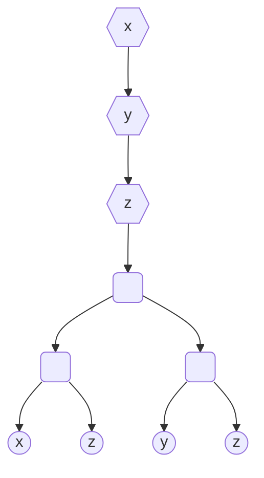
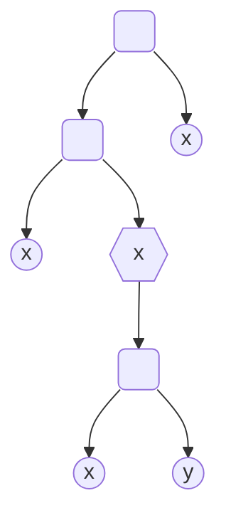

<H1><b>Тема: Вступ до лямбда-числення</b></H1>

Типізоване лямбда-числення є математичним підґрунтям майже всіх розвинених програмних інструментів верифікації програмного забезпечення класу Proof Assistant.

Виходячи з цього даємо короткий огляд безтипового лямбда-числення, а потім різних типізацій цього числення.

## Безтипове лямбда-числення

Будь-яке числення утворюється мовою виразів (або термів) та правилами спрощення цих виразів.
Правила спрощення визначають уніфікований механізм виведення (обчислень) у цьому численні.

### Синтаксис безтипого лямбда числення

**Словник** безтипого лямбда числення включає

- *зліченну* (**!важливо**) множину $\symbf{V}$ атомарних сутностей, що звуться змінними, а також
- спеціальні символи, що **не входять** до $\symbf{V}$ - $\uplambda$; дужка, що відкривається; дужка, що закривається; крапка.

**Cинтаксис** безтипого лямбда числення визначається трьома правилами побудови термів, множина яких позначається через $\symbf{\Lambda}$

```math
\begin{eqnarray}
& \frac{x\in\symbf{V}}{x\in\symbf{\Lambda}} & -\text{конструювання атомів} \\
& \frac{T_1\in\symbf{\Lambda}\quad T_2\in\symbf{\Lambda}}{(T_1\,T_2)\in\symbf{\Lambda}} & -\text{конструювання застосувань} \\
& \frac{x\in\symbf{V}\quad T\in\symbf{\Lambda}}{(\uplambda\,x\mathop{.}T)} & -\text{конструювання абстракцій}\end{eqnarray}
```

Кожний терм можна представити його синтаксичним деревом.
Наприклад, терм $$(\uplambda\ x\mathop{.}(\uplambda\ y\mathop{.}(\uplambda\ z\mathop{.}((x\ z)\ (y\ z)))))$$ має наступне синтаксичне дерево



Шестикутні вузли цього дерева відповідають конструванню абстракції за змінною, що є міткою вузла.

Прямокутні зу скругленими кутами вузли цього дерева відповідають конструктору застосування.

Листя дерева є колами, які відповідають конструюванню атома за змінною, що є міткою вузла.

Кожне входження змінної в терм (лист синтаксичног дерева помічений цією змінною) може бути або **вільним**, або **зв'язаним**.

Неформально кажучи, входження змінної в терм

- є вільним, якщо на шляху від листа, що відповідає входженню змінної, до кореня дерева немає жодного вузла поміченого цією змінною,
- є зв'язаним, якщо на шляху від листа, що відповідає входженню змінної, до кореня дерева є вузол помічений цією змінною.

В наведеному вище прикладі всі входження всіх змінних є зв'язними.

Для терму $((x\ (\uplambda\ x\mathop{.}(x\ y)))\ x)$ синтаксичне дерево має вигляд



Тобто, перше та третє входження змінної $x$ в цей терм є вільними, друге - зв'язаним.
Єдине входження змінної $y$ у цей терм є вільним.

### Перейменування змінних

Давайте для цього прикладу замінемо змінну $x$ у другому входженні та відповідному "зв'язуючому" вузлі на $z$, отримаємо


Осьаннє дерево є синтаксичним деревом терму $((x\ (\uplambda\ z\mathop{.}(z\ y)))\ x)$.

Ці два терми мають ізоморфні синтаксичні дерева з однаковими мітками для вільних входжень змінних і відрізняються лише мітками
зв'язуючих вузлів та відповідних зв'язаних змінних.

Це дає підставу не розрізняти такі терми, точніше вважати їх еквівалентними.
Зазначена еквівалентність у лямбда-численні називається **$\upalpha$-конгруенцією**.

Операція перейменування зв'язаних змінних, яку ми застосували на прикладі, називається **перейменуванням** або
$\upalpha$-конверсією.

Важливим обмеженням операції перейменування є вимога збереження вільних входжень змінних в її результаті.
Тото,

>якщо вузол піддерева синтаксичного дерева терму, до якого застосовується операція перейменування, є вільним у піддереві, тоді
цей вузол має залишитися вільним у піддереві після перейменування.

Зазначене обмеження не порушується у разі, якщо нова змінна обирається серед змінних, які не використовуються в термі.
Такі змінні називаються **свіжими змінними** терму.

Зважаючи на нескінченність множини змінних, два $\upalpha$-конгуентні терми завжди можна привести до одного терма за допомогою
переймувань.
Насправді вірно і зворотнє твердження.

Таким чином,
>Два терми є $\upalpha$-конгуентними тоді і тільки тоді, коли їх можна привести до одного й того самого терму за допомогою
скінчених посдідовностей перейменувань.

