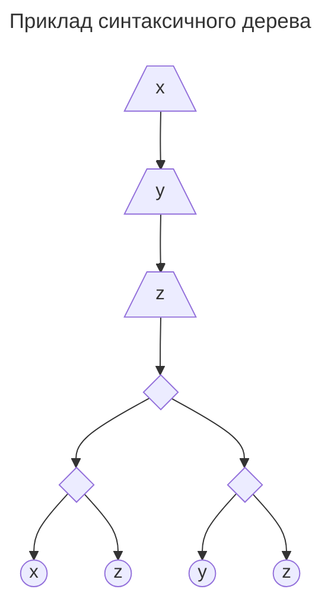
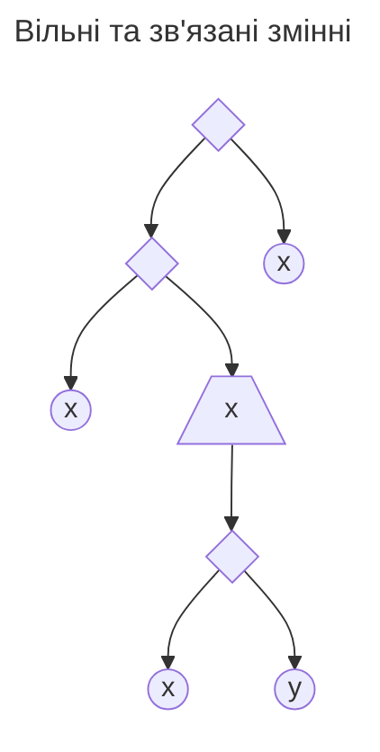
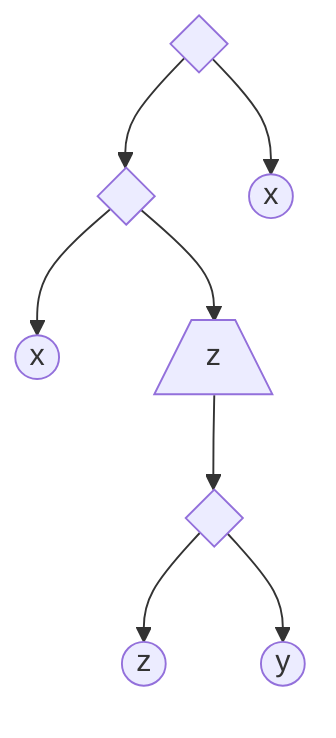
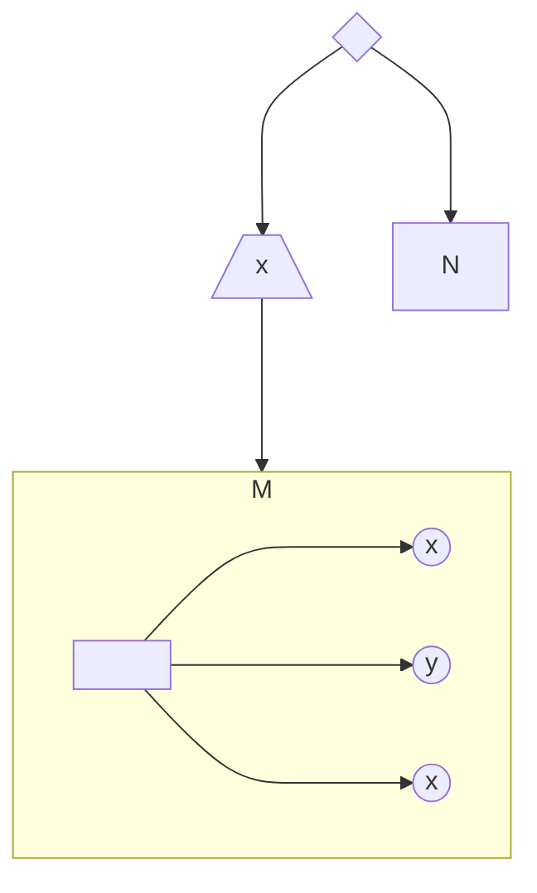
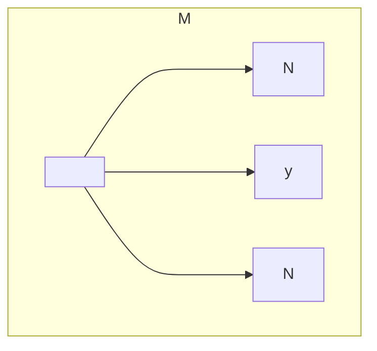
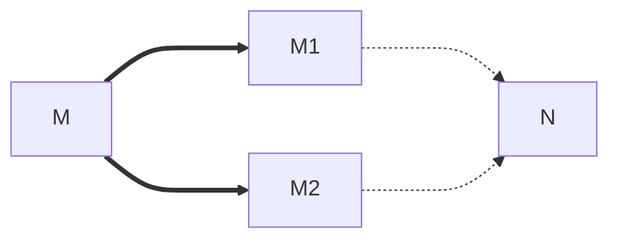

<H1><b>Тема: Вступ до лямбда-числення</b></H1>

Типізоване лямбда-числення є математичним підґрунтям майже всіх розвинених програмних інструментів верифікації програмного забезпечення класу Proof Assistant.

Виходячи з цього даємо короткий огляд безтипового лямбда-числення, а потім різних типізацій цього числення.

## Безтипове лямбда-числення

Будь-яке числення утворюється мовою виразів (або термів) та правилами спрощення цих виразів.
Правила спрощення визначають уніфікований механізм виведення (обчислень) у цьому численні.

### Синтаксис безтипого лямбда числення

**Словник** безтипого лямбда числення включає

- *зліченну* (**!важливо**) множину $\symbf{V}$ атомарних сутностей, що звуться змінними, а також
- спеціальні символи, що **не входять** до $\symbf{V}$ - $\uplambda$; дужка, що відкривається; дужка, що закривається; крапка.

**Cинтаксис** безтипого лямбда числення визначається трьома правилами побудови термів, множина яких позначається через $\symbf{\Lambda}$

```math
\begin{eqnarray}
& \frac{x\in\symbf{V}}{x\in\symbf{\Lambda}} & -\text{конструювання атомів} \\
& \frac{T_1\in\symbf{\Lambda}\quad T_2\in\symbf{\Lambda}}{(T_1\,T_2)\in\symbf{\Lambda}} & -\text{конструювання застосувань} \\
& \frac{x\in\symbf{V}\quad T\in\symbf{\Lambda}}{(\uplambda\,x\mathop{.}T)} & -\text{конструювання абстракцій}\end{eqnarray}
```

>Кожний терм можна представити його синтаксичним деревом.
>Наприклад, терм $$(\uplambda\ x\mathop{.}(\uplambda\ y\mathop{.}(\uplambda\ z\mathop{.}((x\ z)\ (y\ z)))))$$ має наступне синтаксичне дерево



>Трапецеідальні вузли цього дерева відповідають конструванню абстракції за змінною, яка є міткою вузла.<br/>
>Ромбовидніні вузли цього дерева відповідають конструктору застосування.<br/>
>Листя дерева зображені колами; вони відповідають конструюванню атома за змінною, яка є міткою вузла.

Кожне входження змінної в терм (лист синтаксичног дерева помічений цією змінною) може бути або **вільним**, або **зв'язаним**.

Неформально кажучи, входження змінної в терм

- є вільним, якщо на шляху від листа, що відповідає входженню змінної, до кореня дерева немає жодного вузла поміченого цією змінною,
- є зв'язаним, якщо на шляху від листа, що відповідає входженню змінної, до кореня дерева є вузол помічений цією змінною.

В наведеному вище прикладі всі входження всіх змінних є зв'язними.

Для терму $((x\ (\uplambda\ x\mathop{.}(x\ y)))\ x)$ синтаксичне дерево має вигляд



Тобто, перше та третє входження змінної $x$ у цей терм є вільними, друге - зв'язаним.
Єдине входження змінної $y$ у цей терм є вільним.

### Перейменування змінних

Давайте для наведеного прикладу замінемо змінну $x$ у другому входженні та відповідному "зв'язуючому" вузлі на $z$, отримаємо




Осьаннє дерево є синтаксичним деревом терму $((x\ (\uplambda\ z\mathop{.}(z\ y)))\ x)$.

Ці два терми мають ізоморфні синтаксичні дерева з однаковими мітками для вільних входжень змінних і відрізняються лише мітками
зв'язуючих вузлів та відповідних зв'язаних змінних.

Це дає підставу не розрізняти такі терми, точніше вважати їх еквівалентними.
Зазначена еквівалентність у лямбда-численні називається **альфа-конгруенцією**.

Операція перейменування зв'язаних змінних, яку ми застосували на прикладі, називається **перейменуванням** або
альфа-конверсією.

Важливим обмеженням операції перейменування є вимога збереження вільних входжень змінних в її результаті.
Тото,

>якщо вузол піддерева синтаксичного дерева терму, до якого застосовується операція перейменування, є вільним у піддереві, тоді
цей вузол має залишитися вільним у піддереві після перейменування.

Зазначене обмеження не порушується у разі, якщо нова змінна обирається серед змінних, які не використовуються в термі.
Такі змінні називаються **свіжими змінними** терму.

Зважаючи на нескінченність множини змінних, два альфа-конгуентні терми завжди можна привести до одного терма за допомогою
переймувань.
Насправді вірно і зворотнє твердження.

Таким чином,
>Два терми є альфа-конгуентними тоді і тільки тоді, коли їх можна привести до одного й того самого терму за допомогою
скінчених посдідовностей перейменувань.

### Бета-редукція

Перетворення бета редукції моделює процес обчислення функції.

Це перетворення початково застосовується до термів виду $((\uplambda\ x\mathop{.}M)\ N)$, де $M,N$ є термами.
Ефлш терми називаються **редексами** (a ***red***ucible ***ex***pression).
Це перетворення можна проілюструвати наступною схемою:

Терм виду



претворюється на терм



Тобто береться терм $M$ і замість вільних входжегб змінної $x$ підставляється терм $N$, але при цьому вільні ходження змінних
в терму $N$ мають залишитися вільними в новому термі.
Це досягається таким перейменуванням зв'язаних змінних в термі $M$, яке забезпечує диз'юнктність множини зв'язаних змінних $M$
з множиною вільних змінних $N$.  

### Ета-конверсія

Перетворення ета-конверсії забезпечує принцип інтенсиональності для функцій:

> дві функції $f,g:X\to Y$ є рівними, якщо $f(x)=g(x)$ для будь-якого $x\in X$.

Припустимо, що атомарний терм $f$ моделює функцію і розглянемо терм $G=(\uplambda\ x\mathop{.}(f\ x))$.<br/>
Тоді результатом застосування $f$ до терму $X$ буде $(f\ X)$,<br/>
а результатом застосування $G$ до терму $X$ буде $((\uplambda\ x\mathop{.}(f\ x))\ X)\to_\beta(f\ X)$.

Зрозуміло, що терми $f$ та $G$ не є альфа-конгруєнтними, проте вони мають однакову функціональну поведінку, це обґрунтовує таке
правило перетворення

> $(\uplambda\ x\mathop{.}(M\ x))\to_\eta M$ за умови, що $x$ не є вільною у $M$.

###  Обчислювальна рівність термів

Правила перетворення дають нам можливість визначити відношення обчислювальної рівності термів у два кроки.

Перший крок:

> Терм $M$ **редукується** до терму $N$, якщо
> - ці терми є альфа-конгруєтними, або
> - існує скінченна послідовність бета-редукцій та ета-конверсій, яка перетворює $M$ на $N$.

**Теорема Черча-Росера**
>Якщо терм $M$ редукується до будь-яких двох термів $M1$ та $M2$, тоді існує терм $N$ такий, що $M1$ редукується до $N$ і $M2$
редукується до $N$.



**Висновки з теореми Черча-Росера**
>1. Якщо терм можна привести до нормальної форми, тоді ця нормальна форма є єдиною з точність до альфа-конгруентності.
>2. Якщо відношення між термами визначається так: $M$ та $N$ знаходяться в цьому відношенні тоді і тільки тоді, коли існує терм,
до якого редукуються обидва терми $M$ та $N$, тоді це відношення я еквівалентністю.

Еквівалентність, визначена у другому висновку називається ***обчислюваною рівністю*** термів.

## Просто типізоване лямбда числення

### Аномалії редукування

**Петля.**
Розглянемо терм $\Omega_2=((\uplambda\ x\mathop{.}(x\ x))(\uplambda\ x\mathop{.}(x\ x)))$.

Він є редексом, редукування якого дає $\Omega_2$.<br/>
Тобто процес ніколи не закінчується.

**Нескінченний шлях.**
Розглянемо терм $\Omega_{3,2}=((\uplambda\ x\mathop{.}((x\ x)\ x))(\uplambda\ x\mathop{.}((x\ x)\ x))$, тоді процес редукції можна
представити так<br/>
$$\Omega_{3,2}\to_\beta\Omega_{3,3}=(((\uplambda\ x\mathop{.}((x\ x)\ x))(\uplambda\ x\mathop{.}((x\ x)\ x)))
(\uplambda\ x\mathop{.}((x\ x)\ x)))\to_\beta\Omega_{3,4}\to_\beta\ldots\to_\beta\Omega_{3,n}\to_\beta\ldots$$

**Нескінченний шлях у нормалізуємому терм.**
Розглянемо терм $((\uplambda\ x\mathop{.}(\uplambda\ y\mathop{.}y))\Omega_{3,2})$. Якщо редукувати внутрішний редекс, то послідовно
будемо отримувати терми $((\uplambda\ x\mathop{.}(\uplambda\ y\mathop{.}y))\Omega_{3,3})$,
$((\uplambda\ x\mathop{.}(\uplambda\ y\mathop{.}y))\Omega_{3,4})$ і т.д.<br/>
У разі ж редукування зовнішнього редексу зразу отримаємо нормальну форму $(\uplambda\ y\mathop{.}y)$.


### Мова простих типів

### Типізація термів

### Властивості простої типізації


