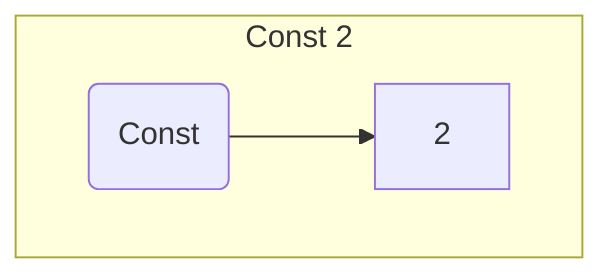

<H1><b>ЛЕКЦІЯ 2. Задача розробки простого програмованого стекового обчислювача</b></H1>

Знайомство з технологією сертифікованого програмування почнемо з мініпроєкту, що демонструє сертифіковану розробку простого програмованого стекового обчислювача.

<details><summary><H2>Завдання мініпроєкту</H2></summary>

Маємо арифметичні вирази, які оперують з натуральними константами за допомогою бінарних операцій додавання і множення.

Абстрактний синтаксис мови арифметичних виразів визначається наступними правилами
- $\mathtt{binop}$ є або $\mathtt{PLUS}$, або $\mathtt{MULT}$
- $\mathtt{const}\ n$ є арифметичним виразом, якщо $n$ є натуральним числом
- $\mathtt{term}\ bop\ e_1\ e_2$ є арифметичним виразом, якщо $bop$ є представником $\mathtt{binop}$, а $e_1$ та $e_2$ є арифметичними виразами

Семантичним значенням арифметичного виразу $e$ будемо вважати натуральне число $\mathtt{denote}\ e$, яке цей вираз представляє.

Детальніше,
- $\mathtt{denote}\ e:=n$, якщо $e\equiv\mathtt{const}\ n$
- $\mathtt{denote}\ e:=\mathtt{denote}\ e_1+\mathtt{denote}\ e_2$, якщо $e\equiv\mathtt{term}\ \mathtt{PLUS}\ e_1\ e_2$, де $e_1$ та $e_2$ є арифметичними виразами

Розглянемо також обчислювач, пам'ять якого представляє собою стек натуральних чисел.

Програма обчислювача є послідовністю команд, кожна з яки є або
- команда $\mathtt{save}\ n$, яка проштовхує $n$ в стек, або
- команда $\mathtt{eval}\ bop$, яка виконує операцію, що визначається значенням $bop$ над двома числами з вершини стеку, видалючі їх і проштовхуючи результат в стек.
Зрозуміло, що ця команда може виконуватися тільки у випадку, якщо у стеку зберігається не менше двох чисел.

Задачею є побудова програми, яка приймає арифметичний вираз та повертає програму для описаного обчислювача, яка обчислює цей арифметичний вираз.

</details>

<details><summary><H2>Необхідні типи даних для представлення арифметичних виразів</H2></summary>

Спроєктуємо та специфікуємо ці типи даних, використовуючи The Coq Proof Assistant.

Першим нашим кроком буде специфікація типу даних `binop`, призначеного для представлення символів бінарних операцій:

```
Inductive binop := plus | mult.
```
Це визначення вводить новий тип з іменем `biniop`, в якому живуть лише дві константи `plus` та `mult`.
Формальною гарантією того, що ніякі інші сутності окрім `plus` та `mult` не живуть в `biniop` представляється такими твердженнями

```
binop_ind  : forall P : binop -> Prop, P Plus -> P Mult -> forall b : binop, P b
binop_rec  : forall P : binop -> Set, P Plus -> P Mult -> forall b : binop, P b
binop_rect : forall P : binop -> Type, P Plus -> P Mult -> forall b : binop, P b
```
Саме команда `Inductive` забезпечує автоматичне генерування цих гарантій, відомих як принципи індукції.

Тепер ми можемо представити абстрактний синтаксис арифметичних виразів, використовуючи The Coq Proof Assistant.

```
Inductive expr :=
  Const : nat -> expr
| Binop : binop -> expr -> expr -> expr.
```

Приклади дерев, що моделюють арифметичні вирази




</details>
