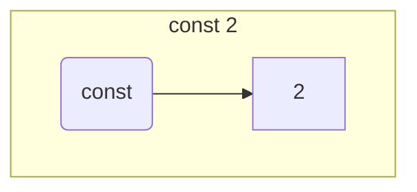

<H1><b>Тема: Задача сертифікованої розробки простого програмованого стекового обчислювача</b></H1>

Знайомство з технологією сертифікованого програмування почнемо з мініпроєкту, що демонструє сертифіковану розробку простого програмованого стекового обчислювача.
Код, що ілюструє викладення знаходиться [тут](https://github.com/gzholtkevych/CertifiedProgramming/blob/main/CoqScripts/SPSC.v).

# Завдання мініпроєкту

**Про цей проєкт:**
Розглядаються

- арифметичні вирази з операціями додавання та множення над натуральними числами.<br/>
Для цих виразів визначається синтаксична структура виразів та їх семантичне значення, яким є результат прямого обчислення відповідного виразу;
- простий програмований стековий обчислювач, пам'ятю якого є стек натуральних чисел, а команди мають наступний формат
  - `save` $n$, де $n$ є натуральне число
  - `eval op`, де `op` є символ операції `PLUS` або `MULT`. 

**Мета прєкту:** побудувати транслятор, який перетворює вираз на програму для простого стекового обчислювача, яка обчислює вираз, опис якого транслюється.

# Мова арифметичних виразів

Детальніше арифметичні вирази утворюються з натуральних констант за допомогою бінарних операцій додавання і множення.

Абстрактний синтаксис мови арифметичних виразів визначається наступними правилами
- символ бінарної операції binop` є або `PLUS`, або `MULT`,
- `const` $n$ є арифметичним виразом, якщо $n$ є натуральним числом,
- `term bop` $e_1\ e_2$ є арифметичним виразом, якщо `bop` є представником `binop`, а $e_1$ та $e_2$ є арифметичними виразами.

Семантичним значенням арифметичного виразу $e$ будемо вважати натуральне число `denote` $e$, яке цей вираз представляє, тобто

- `denote` $e$ має семантичне значення $n$, якщо $e\equiv$ `const` $n$;
- `denote` $e$ має снмантичне значення `denote` (`denote` $e_1$) $+$ (`denote` $e_2$), якщо $e$ має вигляд `term PLUS` $e_1\ e_2$, де $e_1$ та $e_2$ є арифметичними виразами;
- `denote` $e$ має снмантичне значення `denote` (`denote` $e_1$) $\cdot$ (`denote` $e_2$), якщо $e$ має вигляд `term MULT` $e_1\ e_2$, де $e_1$ та $e_2$ є арифметичними виразами.

Спроєктуємо та специфікуємо yеобхідні типи даних для представлення арифметичних виразів, використовуючи The Coq Proof Assistant.

Першим нашим кроком буде специфікація типу даних `binop`, призначеного для представлення символів бінарних операцій:

```coq
Inductive binop := PLUS | MULT.
```

Це визначення вводить новий тип з іменем `biniop`, в якому живуть лише дві константи `PLUS` та `MULT`.
Формальною гарантією того, що ніякі інші сутності окрім `PLUS` та `MULT` не живуть в `biniop`, є такі твердження

```coq
binop_ind : forall P : binop -> Prop, P Plus -> P Mult -> forall b : binop, P b
binop_rec : forall P : binop -> Set, P Plus -> P Mult -> forall b : binop, P b
binop_rect : forall P : binop -> Type, P Plus -> P Mult -> forall b : binop, P b
```

Саме команда `Inductive` забезпечує автоматичне генерування цих гарантій, відомих як принципи індукції.

Тепер ми можемо представити абстрактний синтаксис арифметичних виразів, використовуючи The Coq Proof Assistant.

```coq
Inductive expr :=
  const : nat -> expr
| term : binop -> expr -> expr -> expr.
```

У цьому визначенні використовується тип `nat`, який визначений у стандартній бібліотеці `Coq.Init.Datatypes`, яка завантажується автоматично при запуску `coqide`.
Визначення `nat` у цій бібліотеці є таким

```coq
Inductive nat : Set :=  O : nat | S : nat -> nat.
```

Вілповідні гарантії відсутності зайвих мешканців у типі `nat` є в точності варіантами принципу математичної індукції:

```coq
nat_ind : forall P : nat -> Prop, P 0 -> (forall n : nat, P n -> P (S n)) -> forall n : nat, P n
nat_rec : forall P : nat -> Set, P 0 -> (forall n : nat, P n -> P (S n)) -> forall n : nat, P n
nat_rect : forall P : nat -> Type, P 0 -> (forall n : nat, P n -> P (S n)) -> forall n : nat, P n
```

Наведемо тепер приклади побудови арифметичних виразів:

```coq
Example c2 := const 2.
Example c3 := const 3.
Example ePLUS_c2_c3 := term PLUS c2 c3.
Example c4 := const 4.
Example eMULT_ePLUS_c2_c3_c4 := term MULT ePLUS_c2_c3 c4.
```

Побудову семантики арифметичних виразів почнемо з інтерпретації бінарних операцій як натуральнозначних функцій двох натуральних аргументів:

```coq
Definition binopDenote (bop : binop) : nat -> nat -> nat :=
  match bop with
    PLUS => plus
  | MULT => mult
  end.
```


# Стековий обчислювач

Розглянемо також обчислювач, пам'ять якого представляє собою стек натуральних чисел.

Програма обчислювача є послідовністю команд, кожна з яки є або
- команда $\mathtt{save}\ n$, яка проштовхує $n$ в стек, або
- команда $\mathtt{eval}\ bop$, яка виконує операцію, що визначається значенням $bop$ над двома числами з вершини стеку, видалючі їх і проштовхуючи результат в стек.
Зрозуміло, що ця команда може виконуватися тільки у випадку, якщо у стеку зберігається не менше двох чисел.

Задачею є побудова програми, яка приймає арифметичний вираз та повертає програму для описаного обчислювача, яка обчислює цей арифметичний вираз.


<details><summary><H2>Необхідні типи даних для представлення арифметичних виразів</H2></summary>


Приклади дерев, що моделюють арифметичні вирази



</details>
