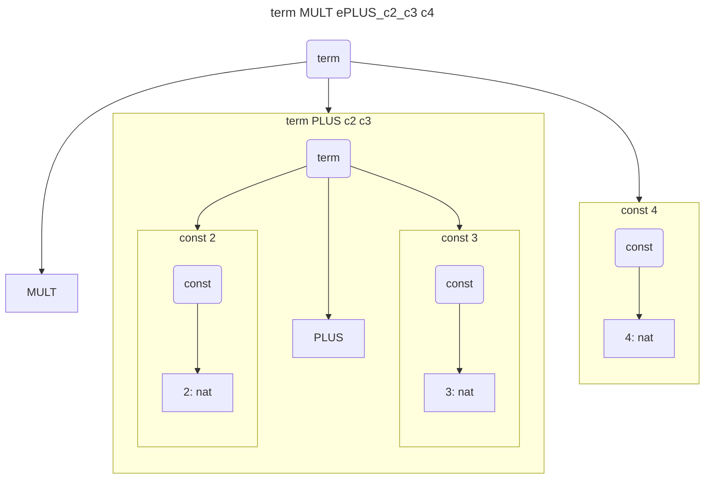

<H1><b>Тема: Задача сертифікованої розробки простого програмованого стекового обчислювача</b></H1>

Знайомство з технологією сертифікованого програмування почнемо з мініпроєкту, що демонструє сертифіковану розробку простого програмованого стекового обчислювача.
Код, що ілюструє викладення знаходиться [тут](https://github.com/gzholtkevych/CertifiedProgramming/blob/main/CoqScripts/SPSC.v).

# Завдання мініпроєкту

**Про цей проєкт:**
Розглядаються

- арифметичні вирази з операціями додавання та множення над натуральними числами.<br/>
Для цих виразів визначається синтаксична структура виразів та їх семантичне значення, яким є результат прямого обчислення відповідного виразу;
- простий програмований стековий обчислювач, пам'ятю якого є стек натуральних чисел, а команди мають наступний формат
  - `save` $n$, де $n$ є натуральне число
  - `eval op`, де `op` є символ операції `PLUS` або `MULT`. 

**Мета прєкту:** побудувати транслятор, який перетворює вираз на програму для простого стекового обчислювача, яка обчислює вираз, опис якого транслюється.

# Мова арифметичних виразів

Детальніше арифметичні вирази утворюються з натуральних констант за допомогою бінарних операцій додавання і множення.

Абстрактний синтаксис мови арифметичних виразів визначається наступними правилами
- символ бінарної операції binop` є або `PLUS`, або `MULT`,
- `const` $n$ є арифметичним виразом, якщо $n$ є натуральним числом,
- `term bop` $e_1\ e_2$ є арифметичним виразом, якщо `bop` є представником `binop`, а $e_1$ та $e_2$ є арифметичними виразами.

Семантичним значенням арифметичного виразу $e$ будемо вважати натуральне число `denote` $e$, яке цей вираз представляє, тобто

- `denote` $e$ має семантичне значення $n$, якщо $e\equiv$ `const` $n$;
- `denote` $e$ має снмантичне значення `denote` (`denote` $e_1$) $+$ (`denote` $e_2$), якщо $e$ має вигляд `term PLUS` $e_1\ e_2$, де $e_1$ та $e_2$ є арифметичними виразами;
- `denote` $e$ має снмантичне значення `denote` (`denote` $e_1$) $\cdot$ (`denote` $e_2$), якщо $e$ має вигляд `term MULT` $e_1\ e_2$, де $e_1$ та $e_2$ є арифметичними виразами.

Спроєктуємо та специфікуємо yеобхідні типи даних для представлення арифметичних виразів, використовуючи The Coq Proof Assistant.

Першим нашим кроком буде специфікація типу даних `binop`, призначеного для представлення символів бінарних операцій:

```coq
Inductive binop := PLUS | MULT.
```

Це визначення вводить новий тип з іменем `biniop`, в якому живуть лише дві константи `PLUS` та `MULT`.
Формальною гарантією того, що ніякі інші сутності окрім `PLUS` та `MULT` не живуть в `biniop`, є такі твердження

```coq
binop_ind : forall P : binop -> Prop, P Plus -> P Mult -> forall b : binop, P b
binop_rec : forall P : binop -> Set, P Plus -> P Mult -> forall b : binop, P b
binop_rect : forall P : binop -> Type, P Plus -> P Mult -> forall b : binop, P b
```

Саме команда `Inductive` забезпечує автоматичне генерування цих гарантій, відомих як принципи індукції.

Тепер ми можемо представити абстрактний синтаксис арифметичних виразів, використовуючи The Coq Proof Assistant.

```coq
Inductive expr :=
  const : nat -> expr
| term : binop -> expr -> expr -> expr.
```

У цьому визначенні використовується тип `nat`, який визначений у стандартній бібліотеці `Coq.Init.Datatypes`, яка завантажується автоматично при запуску `coqide`.
Визначення `nat` у цій бібліотеці є таким

```coq
Inductive nat : Set :=  O : nat | S : nat -> nat.
```

Вілповідні гарантії відсутності зайвих мешканців у типі `nat` є в точності варіантами принципу математичної індукції:

```coq
nat_ind : forall P : nat -> Prop, P 0 -> (forall n : nat, P n -> P (S n)) -> forall n : nat, P n
nat_rec : forall P : nat -> Set, P 0 -> (forall n : nat, P n -> P (S n)) -> forall n : nat, P n
nat_rect : forall P : nat -> Type, P 0 -> (forall n : nat, P n -> P (S n)) -> forall n : nat, P n
```

Наведемо тепер приклади побудови арифметичних виразів:

```coq
Example c2 := const 2.
Example c3 := const 3.
Example ePLUS_c2_c3 := term PLUS c2 c3.
Example c4 := const 4.
Example eMULT_ePLUS_c2_c3_c4 := term MULT ePLUS_c2_c3 c4.
```




Побудову семантики арифметичних виразів почнемо з інтерпретації бінарних операцій як натуральнозначних функцій двох натуральних аргументів:

```coq
Definition binopDenote (bop : binop) : nat -> nat -> nat :=
  match bop with
    PLUS => plus
  | MULT => mult
  end.
```

Це визначення інтерпретує `binopDenote PLUS` як стандартну функцію `plus` з бібліотеки `Coq.Init.Peano`, а `binopDenote MULT` як стандартну
функцію `mult` з тієї ж бібліотеки.

Зазначимо, що імена `plus` та `mult` є аліасами імен `Nat.add` та `Nat.mul` відповідно, які показують, що визначення функцій знаходяться в
модулі `Nat`, в якому зібрана більшість визначень, пов'язаних з типом `nat`.

Тепер дамо визначення семантичного значення виразів:

```coq
Fixpoint exprDenote (e : expr) : nat :=
  match e with
    const n        => n
  | term bop e1 e2 => binopDenote bop (exprDenote e1) (exprDenote e2)
  end.
```

Команда `Fixpoint` на відміну від команди `Definition` означає, що визначення є рекурсивним - у четвертому рядку визначення використовується
посилання `exprDenote`, значення якого визначається. 

Подивимося як це працює.

Вводимо:

```coq
Eval simpl in exprDenote c2.
```

Отримуємо:

```coq
= 2 : nat
```

Вводимо:

```coq
Eval simpl in exprDenote c3.
```

Отримуємо:

```coq
= 3 : nat
```

Вводимо:

```coq
Eval simpl in exprDenote ePLUS_c2_c3.
```

Отримуємо:

```coq
= 5 : nat
```

Вводимо:

```coq
Eval simpl in exprDenote eMULT_ePLUS_c2_c3_c4.
```

Отримуємо:

```coq
= 20 : nat
```

# Стековий обчислювач

Простий стековий обчислювач має

- пам'ять, яка структурована як стек, та
- механізм виконання програм, які є списками інструкцій.

Для формалізації як станів пам'яті так і програм використовується ствндартний тип список (`list`) із стандартної бібліотеки `Coq.Init.Datatypes`.

Цей тип визначається як

```coq
Inductive list (A : Type) : Type :=  nil : list A | cons : A -> list A -> list A.
```

Цей тип є поліморфним, тобто параметрично залежним від іншого (базового) типу - типу його членів.

Програма обчислювача є списком команд, кожна з яки є або
- командою `save` $n$, яка проштовхує $n$ в стек, або
- командою `eval bop`, яка виконує операцію, що визначається значенням `bop`, над двома числами з вершини стеку, видалючі їх і натомість
проштовхуючи в стек результат обчислення.
Зрозуміло, що ця команда може виконуватися тільки у випадку, якщо у стеку зберігається не менше двох чисел.

Формалізуємо еавелений опис обчислювача.

Визначення типу для представлення пам'ті:

```coq
Definition stack := list nat.      (* тип для станів пам'яті обчислювача *)
```

Визначення типу для представлення інструкцій:

```coq
Inductive instr : Set :=           (* тип для інструкцій обчислювача *)
  | save : nat -> instr
  | eval : binop -> instr.
```

Вмзначення типу для представлення програми обчислювача:

```coq
Definition program := list instr.  (* тип для програм обчислювача   *)
```

Визнвчемо також  семантичні значення:

- інструкцій обчислювача, як перетворень станів пам'яті до виконання інструкції на стани пам'яті після її виконання
з можливою помилку виконання 

```coq
Definition instrDenote (i : instr) : stack -> option stack :=
  fun s =>
    match i with
      save n => Some (n :: s)
    | eval b => match s with
                  n :: m :: s' => Some ((binopDenote b n m) :: s')
                | _            => None
                end
    end.
```

Результат виконання програми з певного стану стеку

```coq
Fixpoint execute (p : program) : stack -> option stack :=
  fun s =>
    match p with
      nil     => Some s
    | i :: p' => match instrDenote i s with
                 | None    => None
                 | Some s' => execute p' s'
                 end
  end.
```

Семантичне значення програми є результатом її виконання з порожнього стану стеку.

```coq
Definition programDenote (p : program) : option stack := execute p nil.
```

# Задача трансляції

>Визначити функцію `compile : expr -> program`, яка перетворює вираз на програму, що має семантичне значення ***узгоджене***
з семантичним значенням виразу.<br/>
>Узгодженість формально для цієї задачі розуміється як справедливість наступної теореми коректності

```coq
Theorem correctness : forall e : expr,
  Some [exprDenote e] = programDenote (compile e).
```

Ця теорема вимагвє, щоб програма, створена функцією `compile` для будь-якого виразу, на порожньому стеку завершувалася б без
помилки і стек після її виконання містив би всього одне значення, а саме значення виразу, що компілювався.

Таким чином, задача ***сертифікованого програмування*** у цьому випадку полягає у
- розробці програми, що реалізує функцію `compile`;
- доведенні коректності цієї програми, тобто у побудові терма `correctness`, який має тип<br/>
```coq
forall e : expr, Some [exprDenote e] = programDenote (compile e). 
```

## Функція `compile`

Ми будемо будувати програму за допомогою функції конкатенації списків

```coq
app = fun A : Type =>
  fix app (l m : list A) {struct l} : list A :=
    match l with
      [] => m
    | a :: l1 => a :: app l1 m
    end
: forall A : Type, list A -> list A -> list A
```
зі стандартної бібліотеки `Coq.Init.Datatypes`.
Ця функція зазвичай використовується як інфіксний бінарний оператор

```coq
Infix "++" := app (right associativity, at level 60) : list_scope.
```

Давайте визначимо `compile` у такий спосіб 

```coq
Fixpoint compile (e : expr) : program :=
  match e with
    const n => [save n]
  | term b e1 e2 => (compile e2) ++ (compile e1) ++ [eval b]
  end.
```

Інакше кажучи, вираз, що є константою `n : nat` транслюється у програму з однієї інструкції `save n`.<br/>
В той же час, вираз, що будується за допомогою конструктора `term`, компілюєтья у програму для другого операнда,
до якої доєднана програма для першого операнда, а до результату в кінець додана інструкція `eval b`, де `b` є
знаком операції в корені виразу.

Давайте відкомпілюємо вираз `eMULT_ePLUS_c2_c3_c4` (див. вище)

```coq
Example p := compile eMULT_ePLUS_c2_c3_c4.
```

Тоді отримаємо

```coq
Eval compute in p.
= [save 4; save 3; save 2; eval PLUS; eval MULT]
     : program
``` 
Eval compute in programDenote p.
